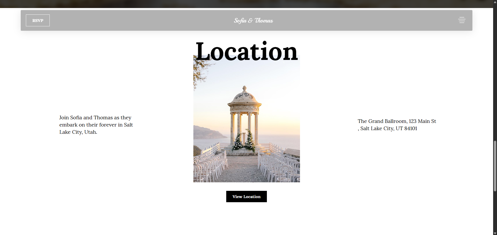

# Wedding
A personal project to improve animation and layout skills using HTML &amp; CSS

🔗 [Live Demo](https://yasin-tahmasbi.github.io/Wedding/)

##

This project is a personal front-end practice aimed at enhancing **animation and user interaction skills**. 
The visual design was created by one creative individuals, while I handled all the coding with HTML, CSS (Grid and Flexbox), and a portion of JavaScript for the menu and interactions.

## 🛠️ Features

- Focus on **animations** throughout different sections of the site
- Built with **HTML5 & CSS3**
- Layout structured using **Grid and Flexbox**
- Minimal use of **JavaScript** for the menu and small interactions

## 👤 Credits

- **Developed by:** [Yasin Tahmasbi](https://yasintahmasbi.ir/)
- **Design by:** [Sara Zargan](https://www.linkedin.com/in/sara-zargan-80b7b02b6/)
- **Mentorship:** [Parsa Ghorbanian](https://www.instagram.com/parsa_ghorbanian_web/#)
- **Date:** Oct , 2025

## **🔗 Want to reach out?**

Everything you need is on my website 👇

-  [**www.yasintahmasbi.ir**](https://www.yasintahmasbi.ir)

## 📷 Preview | Screenshots

